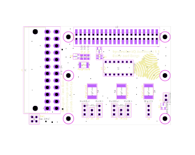

# SynaesthetiQ Hardware

SynaesthetiQ's hardware centre's around a pair of flexible LED Matrices which have been wrapped around a 3D printed core, palced on top of this core is a 30W RGB COB LED.

## AuxBoard

SynaesthetiQ has an Auxillary Board which provides power to both of the matrices, the big led, Raspberry Pi 4B and a fan for cooling. This board is detailed in the [AuxBoard KiCad project](./AuxBoard/). This board distributes power provided by an ATX power supply while also providing Back Powering protection from the RPI and polyfuse protection to each of the four areas of supply on the board. AuxBoard provides levelshifting from the 3.3v of the RPI's logic to the 5v of the matrices and the big LED.

### Schematic

### PCB Layout

### Final PCB's
Below is two of the eventual three PCBs made for the project.
